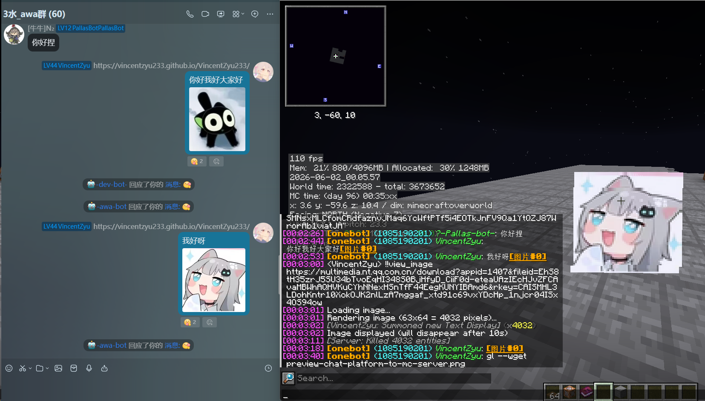
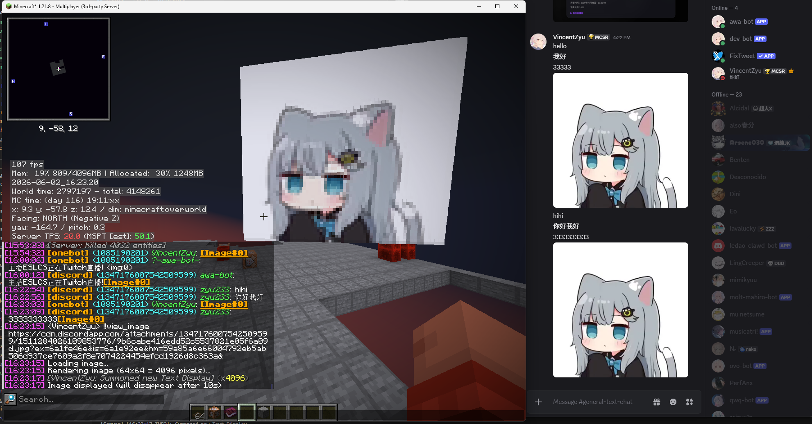

# koishi-plugin-mclistener-ws-client

🌐 Minecraft 群服互通 WebSocket 客户端：对接 MCDR 插件，实现双向消息转发、玩家进出通知、消息过滤等功能。

[](https://www.npmjs.com/package/koishi-plugin-mclistener-ws-client)
[](https://www.npmjs.com/package/koishi-plugin-mclistener-ws-client)

[](https://github.com/VincentZyuApps/koishi-plugin-mclistener-ws-client)
[](https://gitee.com/vincent-zyu/koishi-plugin-mclistener-ws-client)

[](https://qm.qq.com/q/4vjto4V7Di)


<p><del>💬 插件使用问题 / 🐛 Bug反馈 / 👨‍💻 插件开发交流，欢迎加入QQ群：<b>259248174</b>   🎉（这个群G了</del> </p> 
<p>💬 插件使用问题 / 🐛 Bug反馈 / 👨‍💻 插件开发交流，欢迎加入QQ群：<b>1085190201</b> 🎉</p>
<p>💡 在群里直接艾特我，回复的更快哦~ ✨</p>

---

## 📖 简介

还在手动看 Minecraft 服务器后台？还在纠结群里发的消息怎么同步到游戏里？

**mclistener-ws-client** 是一个 Koishi 插件，基于 WebSocket 对接服务端 MCDR 插件 [](https://github.com/VincentZyuApps/mcdr_listener_ws_server) [`mcdr_listener_ws_server`](https://gitee.com/vincent-zyu/mcdr_listener_ws_server)，实现 **群服互通** —— 不止于文字！🎉

以 WebSocket 客户端方式对接服务端的 MCDR（MCDReforged）插件，实现 **聊天平台 ↔ 服务器** 的双向消息互通。玩家进服/离服自动播报，聊天消息实时同步，还支持白名单/黑名单过滤、自定义消息模板等酷炫功能。

---

## 🚀 3 分钟快速上手

### Step 1: 配置服务端（MCDR 插件）

1. 将 `mcdr_listener_ws_server` 放入 MCDR 插件目录，安装依赖(具体配置流程参考MCDR插件文档: https://github.com/VincentZyuApps/mcdr_listener_ws_server)
2. 加载插件，编辑生成的 `/path-to-mcdr-root/config/mcdr_listener_ws_server/config.yml`
3. 修改 `ws_token` 为你自己的密码（客户端需保持一致）

### Step 2: 配置本插件（Koishi）

1. 在 Koishi 插件市场 或者 使用 `npm/yarn` 安装 `mclistener-ws-client`
2. 配置 `wsServerUrl` 指向服务端 WebSocket 地址（默认 `ws://127.0.0.1:60601`）
3. 配置 `wsToken` 与服务端 `ws_token` 一致
4. 配置 `sourcePlatformList` 和 `targetPlatformChannelList` 为你的群/频道

### Step 3: 验证互通

- 在群里发消息 → 检查游戏内是否收到
- 在游戏里说话 → 检查群里是否收到

> 💡 图片渲染和远程命令需要额外配置 RCON，见下方 [前置条件](#️-前置条件启用-rcon)。

---

## 📸 效果预览

### **→ MC 服务器 → 聊天平台**
- 玩家在服里说话、进出事件自动同步到聊天平台
##### **QQ（OneBot v11）**: 

### **→ 聊天平台 → MC 服务器**
- 群里发的图文消息自动转发到游戏内
##### **QQ（OneBot v11）**: 
##### **Discord**: 

### **→ 聊天平台远程执行命令**
- 通过 Koishi 指令远程执行 MC 服务器命令，结果回传到聊天平台
##### **QQ（OneBot v11）**: 

---

## ⚠️ 前置条件：启用 RCON

以下核心功能**必须**启用 RCON 才能使用：
- 🖼️ **游戏内展示外部图片**（`!!view_image` 命令 + 图片消息渲染）
- 🖥️ **远程命令执行**（从聊天平台执行 MC 服务器命令并返回结果）

> 如果你只需要基础的文字消息转发和进出服通知，可以跳过此步骤。
>
> 📖 详见服务器端MCDR插件文档：[## RCON 配置步骤](https://github.com/VincentZyuApps/mcdr_listener_ws_server#%EF%B8%8F-%E5%89%8D%E7%BD%AE%E6%9D%A1%E4%BB%B6%E5%90%AF%E7%94%A8-rcon)

---

## ✨ 功能

### 🌐 WebSocket 连接

- 作为 WebSocket 客户端连接 MCDR 端的 WebSocket 服务
- 支持自动重连，连接/断开事件可通知到指定用户/频道/控制台

### 📤 群服双向消息转发

**MC 服务器 → 聊天平台**
- 玩家在mc服里说话、玩家进出mc服务器事件 自动同步到聊天平台

**聊天平台 → MC 服务器**
- 群里发的图文消息自动转发到游戏内

> 支持多平台多频道（QQ、Kook、Discord、Telegram 等，理论上 koishi支持的大部分主流聊天平台都能用）

### 🚪 玩家进出通知

- 玩家加入服务器时，自动在群里发送欢迎消息 🎉
- 玩家离开服务器时，自动在群里发送告别消息 😢
- 支持自定义消息模板，使用 `%PLAYER%` 占位符

### 💬 消息过滤

| 过滤方式 | 说明 |
|---------|------|
| ✅ **白名单前缀** | 只转发指定前缀开头的消息（如 `!!`） |
| ❌ **黑名单前缀** | 阻止转发指定前缀的消息（如 `/` 命令） |
| 🚫 **发送者黑名单** | 阻止转发指定玩家的消息（如 `Server`） |
| 🔍 **平台消息前缀检查** | 只转发群里指定前缀的消息到服务器（如 `#`） |

### ✏️ 自定义消息模板

- 玩家加入/离开消息模板自由定制
- 聊天消息转发格式自由定制
- 支持 `%PLAYER%`（玩家名）、`%CONTENT%`（聊天内容）占位符

### 🕐 日期时间前缀

- 转发到聊天平台时可自动添加日期时间前缀，方便查看消息时间

### 🐛 调试日志

- 可选详细控制台输出，方便排查连接和转发问题

--- 

## 📦 安装

在 Koishi 插件市场搜索 `mclistener-ws-client` 即可安装。

或使用 npm / yarn：

```bash
cd /path/to/koishi-app
# 确保能看到 koishi.yml, package.json, data文件夹等等
ls
# 使用npm 安装
npm install koishi-plugin-mclistener-ws-client
# 或者使用yarn
yarn add koishi-plugin-mclistener-ws-client
```

--- 

## ⚙️ 配置

### 最小可用配置

```yaml
wsServerUrl: ws://你的服务器IP:60601
wsToken: 你的Token
sourcePlatformList:
  - platform: onebot
    channelId: 你的QQ群号
    enable: true
targetPlatformChannelList:
  - platform: onebot
    channelId: 你的QQ群号
    enable: true
```

### 💬 消息设置

| 配置项 | 默认值 | 说明 |
|--------|--------|------|
| `enableQuote` | `true` | 启用回复引用，指令回复自动带引用 |

### 🌐 WebSocket 连接配置

| 配置项 | 默认值 | 说明 |
|--------|--------|------|
| `wsServerUrl` | `ws://127.0.0.1:60601` | WebSocket 服务器地址 |
| `wsToken` | `test12345` | WebSocket 连接 Token（空=不校验）⚠️ 建议修改默认值 |

### 📊 报告配置

| 配置项 | 默认值 | 说明 |
|--------|--------|------|
| `enablePrivateReport` | `false` | 启用私聊报告 |
| `privateReportUserIdList` | `[]` | 私聊报告用户列表（平台 + 用户ID） |
| `enableChannelReport` | `false` | 启用频道报告 |
| `reportChannelList` | `[]` | 报告频道列表 |
| `enableConsoleLogReport` | `true` | 启用控制台日志报告 |

### 📤 转发目的地配置（服务器 → 聊天平台）

| 配置项 | 默认值 | 说明 |
|--------|--------|------|
| `enableAddDateTimePrefix` | `true` | 转发时添加日期时间前缀 |
| `targetPlatformChannelList` | `[{onebot, 1085190201}]` | 目标平台频道列表（默认转发到 onebot 群的 1085190201） |

### 📥 来源平台配置（聊天平台 → 服务器）

| 配置项 | 默认值 | 说明 |
|--------|--------|------|
| `stripMessageWhitespace` | `true` | 🧹 清理消息中的换行和制表符，将 `\n` `\r` `\t` 替换为空格，压缩连续空格，避免游戏内消息断裂 |
| `sourcePlatformList` | `[{onebot, 1085190201}]` | 来源平台频道列表（默认监听 onebot 群 1085190201） |

> ℹ️ 当前转发到服务端的 `group_name` 填入的是平台标识（如 `onebot`、`discord`），并非真实群名/频道名。真实来源 ID 在 `group_id` 字段。

### 🚪 玩家加入消息转发

| 配置项 | 默认值 | 说明 |
|--------|--------|------|
| `enableForwardPlayerJoin` | `true` | 启用转发玩家加入消息 |
| `customizePlayerJoinMsg` | `🎉🎉🎉 %PLAYER% 进入了神秘小服服！！✨✨✨` | 自定义加入消息模板 |

### 🚶 玩家离开消息转发

| 配置项 | 默认值 | 说明 |
|--------|--------|------|
| `enableForwardPlayerLeave` | `true` | 启用转发玩家离开消息 |
| `customizePlayerLeaveMsg` | `😢😢😢 %PLAYER% 暂时离开啦~呜——👋👋👋` | 自定义离开消息模板 |

### 💬 玩家聊天消息转发

| 配置项 | 默认值 | 说明 |
|--------|--------|------|
| `enableForwardPlayerChat` | `true` | 启用转发玩家聊天消息 |
| `customizePlayerChatMsg` | `🔈🔈🔈%PLAYER%在神秘小服服说: %CONTENT%` | 自定义聊天消息模板 |
| `enableFowardMsgPrefixWhitelistCheck` | `false` | 启用白名单前缀检查 |
| `fowardMsgPrefixWhitelistList` | `['#']` | 白名单前缀列表 |
| `enableForwardMsgPrefixBlacklistCheck` | `true` | 启用黑名单前缀检查 |
| `fowardMsgPrefixBlacklistList` | `['/', '!!']` | 黑名单前缀列表 |
| `enableSenderBlacklistCheck` | `false` | 启用发送者黑名单检查 |
| `senderBlacklistList` | `['Server']` | 发送者黑名单列表 |

### 🔄 平台消息转发到服务器

| 配置项 | 默认值 | 说明 |
|--------|--------|------|
| `enableFowardPlatformChat` | `true` | 启用转发平台消息到服务器 |
| `platformChatPrefixCheck` | `false` | 启用平台消息前缀检查 |
| `platformChatPrefixList` | `['#']` | 平台消息前缀列表 |
| `excludeBotMessages` | `true` | 排除机器人自己发送的消息 ⚠️ 判定逻辑包含昵称子串匹配：昵称中包含 `bot` 或 `机器人` 的用户也会被排除，如有误杀请关闭此选项 |

> ⚠️ **富文本支持范围**: 当前仅处理文本、@提及（转为 `<at @userId>`）、图片（转为 `` + images 数组）。其他平台特有消息元素（如表情、卡片、文件等）会退化为 `<元素类型>` 占位文本。

### 🔐 远程命令执行配置

| 配置项 | 默认值 | 说明 |
|--------|--------|------|
| `enableExecCommand` | `false` | 启用远程命令执行能力 |
| `execCommandName` | `mcws.exec` | Koishi 指令名 |
| `enableExecCommandWhitelist` | `true` | 启用用户白名单 |
| `execCommandAdminUserIdList` | `[{onebot, 1830540513}]` | 允许执行命令的用户白名单（默认管理员 onebot 的 1830540513） |
| `execCommandTimeoutMs` | `10000` | 命令执行超时时间（毫秒） |
| `execCommandMaxReplyLength` | `1500` | 回复最大字符数 |

## 🖥️ 命令

### `mcws.exec <cmd>`

在 MC 服务器上远程执行命令，结果回传到聊天平台。

- **默认指令名**: `mcws.exec`（可通过 `execCommandName` 配置修改）
- **使用示例**: `mcws.exec list`
- **权限控制**: 默认仅白名单用户可执行（`enableExecCommandWhitelist`），白名单通过 `execCommandAdminUserIdList` 配置
- **前置条件**:
  - 客户端: `enableExecCommand` 设为 `true`
  - 服务端: `enable_remote_exec_command` 设为 `true`
  - 服务端: RCON 已启用（见 [RCON 配置](#️-前置条件启用-rcon)）
- **输出**: 超过 `execCommandMaxReplyLength`（默认 1500 字符）的结果会被截断

---

### 🐛 调试配置

| 配置项 | 默认值 | 说明 |
|--------|--------|------|
| `verboseConsoleOutput` | `false` | 启用详细控制台调试输出 |

#### 🐛 verboseConsoleOutput 调试日志输出项

开启 `verboseConsoleOutput` 后，插件会在控制台输出以下调试信息：

> **🔌 WebSocket 连接生命周期**
> - 创建 / 销毁 WS 客户端实例
> - 连接状态变化（连接中、已连接、已关闭、具体错误原因）
> - 收到 / 发送的原始 WS 消息内容
> - 重连定时器的设置、取消、跳过原因
>
> **📤 消息处理与转发**
> - 解析到的服务器消息类型、玩家名、消息内容
> - 准备发送到频道的消息
> - 跳过未启用的目标频道原因
> - 消息被白名单 / 黑名单 / 发送者黑名单拦截的详情
>
> **💬 平台消息中间件**
> - 中间件收到的消息内容与来源（platform / channelId / userId）
> - 自动排除机器人消息的判断过程
> - 来源平台 / 频道匹配结果
> - 前缀检查结果与是否跳过转发
>
> **⚙️ 插件初始化与生命周期**
> - 插件初始化时的完整配置 dump
> - ready / dispose 事件触发时序
> - 中间件注册与清理过程

---

## ⚠️ 一些已知限制

- **图片域名白名单**: 图片 URL 的域名必须在服务端 `image_host_whitelist` 中，否则不会下载/渲染
- **全服冷却**: `!!view_image` 有全服共享冷却（默认 5.5 秒），冷却期间其他玩家无法使用
- **富文本降级**: 非文本消息元素（表情、卡片、文件等）会退化为 `<元素类型>` 占位文本，无法保留原样式
- **远程命令需双边开启**: 需要同时开启客户端 `enableExecCommand` 和服务端 `enable_remote_exec_command`
- **编码问题**: Windows 下 MCDR 建议将 encoding 设为 GBK，避免 emoji 编码问题
- **Bot 误杀**: 昵称包含 `bot` 或 `机器人` 的用户消息可能被 `excludeBotMessages` 误排除

### 📌 部分技术细节

- **重连间隔**: 断开后固定 5 秒自动重连
- **多实例**: 插件声明 `reusable`，支持在 Koishi 中配置多个实例对接多台服务器
- **依赖**: 需要 Koishi 的 `http` 服务（通常由 `@koishijs/plugin-http` 提供）
- **Token 传递**: `wsToken` 通过 WebSocket URL 的 query 参数 `?token=xxx` 传递
- **条目独立开关**: 配置列表（如 `sourcePlatformList`）中的每个条目都有独立的 `enable` 开关
